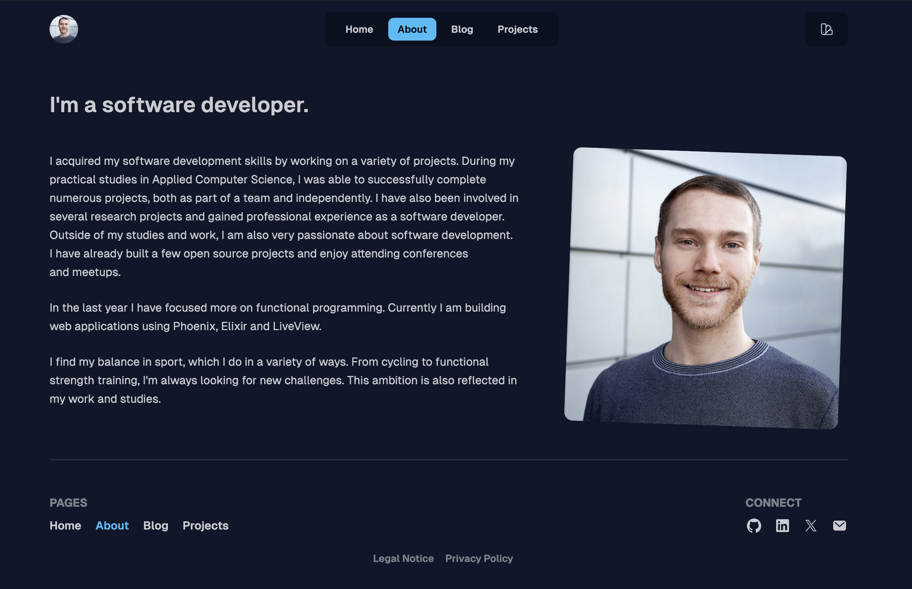

  

<h3 align="center">My website and blog built with Phoenix and Elixir.</h3>

  <a href="https://farens.me/"><strong>Go to website →</strong></a>
   
   
  <a href="https://x.com/flo_arens">x.com</a>
  •
  <a href="mailto:info@farens.me">E-mail</a>
  •
  <a href="https://linkedin.com/in/florian-arens">LinkedIn</a>

## About

This is the source code for my personal website and blog. It is built using the Phoenix Framework and Elixir. I built it mainly for learning purposes, to use as a digital playground. I use the blog to document my learning journey and to share my thoughts and ideas. Have a look around and let me know if you find any bugs or have any suggestions for improvement.

## Technologies

- **Framework**: [Phoenix Framework](https://phoenixframework.org/)
- **Styling**: [Tailwind CSS](https://tailwindcss.com/) and [daisyUI](https://daisyui.com/)
- **Deployment**: [Fly.io](https://fly.io/)

## Development

To start your Phoenix server:

  * Run `mix setup` to install and setup dependencies
  * Start Phoenix endpoint with `mix phx.server` or inside IEx with `iex -S mix phx.server`

Now you can visit [`localhost:4000`](http://localhost:4000) from your browser.

Ready to run in production? Please [check our deployment guides](https://hexdocs.pm/phoenix/deployment.html).

## Learn more about Phoenix

  * Official website: https://www.phoenixframework.org/
  * Guides: https://hexdocs.pm/phoenix/overview.html
  * Docs: https://hexdocs.pm/phoenix
  * Forum: https://elixirforum.com/c/phoenix-forum
  * Source: https://github.com/phoenixframework/phoenix
